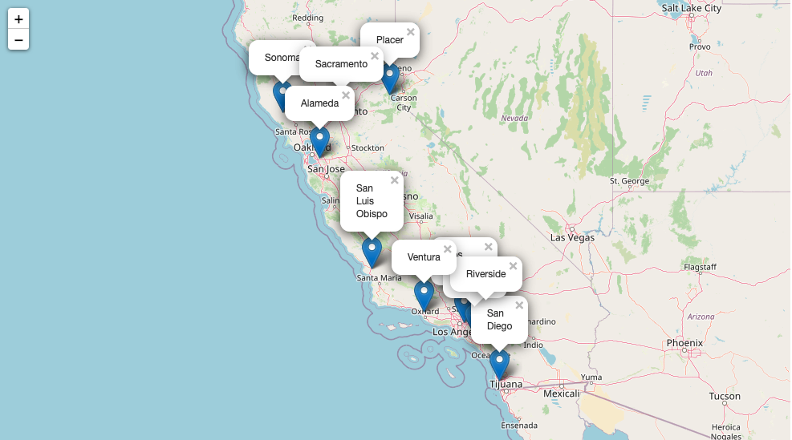
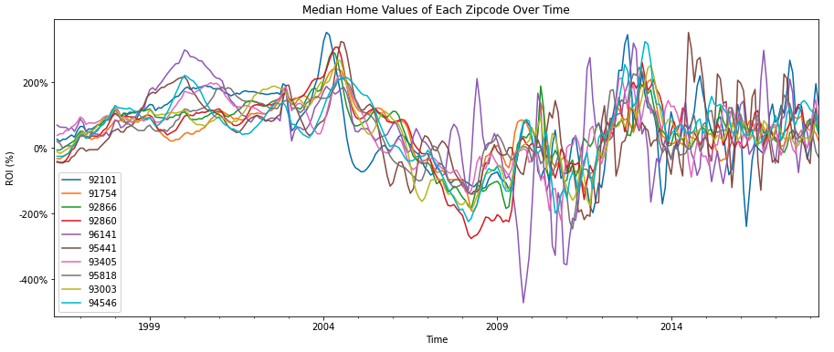
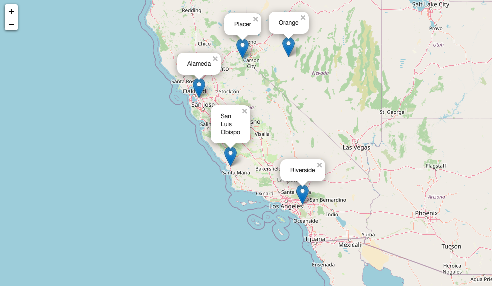
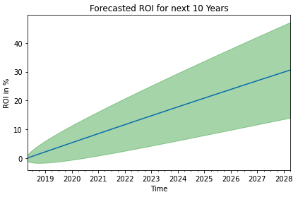

# Zillow Times Series Analysis
**Author**: Jennifer Ha

## Overview
With their recent successful real estate investment in New York, our client Stellar Property Group seeks to expand their listings in California, which happens to be the other state with the most Fortune 500 company headquarters besides New York. Our client believes the trends and contributing factors that they saw in New York, especially the continued job growth will also positively impact the home values in California. The team is looking for recommendations on top 5 zipcodes to invest in California, and this analysis will also provide them with short-term vs. long-term investment decisions.
***
## Business Problem
The goal of this analysis is to identify the top 5 zipcodes for our client to invest in California. The team is not quite familiar with the West Coast real estate market, and therefore, has asked to take risk factor into consideration. The results from this analysis will provide them with the forecast of the next 10 year mean house values in the top 5 zipcodes as well as expected ROI in 1 year, 3 years, 5 years, and 10 years. 
***
## Data
The dataset for this analysis comes from [Zillow Research](https://www.zillow.com/research/data/), which contains the median home sales prices in 14,723 individual zipcodes from April 1996 through April 2018. Each row represents a unique zip code indexed with RegioinID, and contains location info and median housing sales prices for each month.

***
## Methods
To begin with, this project explores zipcodes in California only (1,224 zipcodes). Then I calculated the average ROI from April 1996 to April 1998 to narrow down the list to top 10 counties. To further clean up the data before running predictions, I prepared top 10 zipcodes by selecting the zipcode with the highest average ROI in each county.

I wanted to be mindful of some financial events that happened in the past (e.g. Housing Bubble and Great Recession, and used the [coefficient of variantion](https://www.investopedia.com/terms/c/coefficientofvariation.asp) to take risk into consideration. This is a very common method being used in finance to determine how much volatility, or risk, is assumed in comparison to the amount of return expected from investments. I also selected data in 30-70 quartiles to add some variation.

For prediction, I ran some time series models, and selected the SARIMAX model that performed the best to forecast the predicted average home values for each zipcode for the next 10 years (2018-2028).
***
## Results
Our results showed that below counties had the highest ROI between April 1996 and April 2018.

 

All counties showed at least 125% of ROI on average since 1996. Out of those counties, Orange, Alameda, and San Luis Obispo counties had the highest ROI around 200%.


Below is a ROI trend of zipcodes with the highest ROI in each county.



The metrics used to evaluate the models were RMSE since we want the lowest error between the actual and predicted price of houses. 

| Zipcode | City          | County         | RMSE 
| --------| ------------- | -------------- | ---- 
| 92101 | San Diego       | San Diego      | $4930.90 
| 91754 | Monterey Park   | Los Angeles    | $2522.42
| 92866 | Orange          |Orange          | $2585.74
| 92860 | Norco           |Riverside       | $2198.00
| 96141 | Homewood        | Placer         | $4287.85
| 95441 | Geyserville     | Sonoma         | $6990.77
| 93405 | San Luis Obispo |San Luis Obispo | $3504.44
| 95818 | Sacramento      | Sacramento     | $2829.32
| 93003 | Ventura         | Ventura        | $1750.29
| 94546 | Castro Valley   | Alamenda       | $4241.23 

***
## Recommendation
Below are the top 5 zipcodes that showed the higher expected ROI than the rest, and the recommendation on short-term vs. long-term investment decisions .

 

**Zip code 91754 (Orange):** Buy and hold for at least 10 years due to 
continued ROI growth.

           Total expected return in 1 year: 2.94%
           Total expected return in 3 years: 8.74%
           Total expected return in 5 years: 14.42%
           Total expected return in 10 years: 27.90%
                                  
                                
**Zip code 92860 (Riverside):** Buy and sell after 3 years as expected ROI levels out.

           Total expected return in 1 year: 2.81%
           Total expected return in 3 years: 4.25%
           Total expected return in 5 years: 4.45%
           Total expected return in 10 years: 4.49% 
                                           
                                  
**Zip code 96141 (Placer):** Buy and hold for at least 10 years due to 
continued ROI growth.

           Total expected return in 1 year: 9.06%
           Total expected return in 3 years: 26.99%
           Total expected return in 5 years: 44.99%
           Total expected return in 10 years: 89.22%
          

**Zip code 93405 (San Luis Obispo):** Buy and sell after 3-5 years as expected ROI levels out.

           Total expected return in 1 year: 2.01%
           Total expected return in 3 years: 3.55%
           Total expected return in 5 years: 3.95%
           Total expected return in 10 years 4.08%
  

**Zip code 94546 (Alameda):** Buy and hold for at least 10 years due to 
continued ROI growth.

           Total expected return in 1 year: 3.19%
           Total expected return in 3 years: 9.50%
           Total expected return in 5 years: 15.72%
           Total expected return in 10 years: 30.62%
  

***
## Next Steps:
1. We can potentially add more recent data to increase the effectiveness of the model. It would be interesting to examine if any recent events like COVID-19 have affected the real estate market.

2. This project was purely based on using past average home values to make predictions for the next 10 years. The analysis can be more meaningful if we could take other contributing factors for a home value, such as population, tax rate, school ranking, property size into consideration.


## For More Information
See the full analysis in the [Jupyter Notebook](https://github.com/jennifernha/Zillow-Time-Series/blob/main/Zillow-Times-Series.ipynb) or review this [presentation](https://github.com/jennifernha/Zillow-Time-Series/blob/main/Presentation.pdf). For additional info, contact Jennifer Ha at jnha1119@gmail.com
***
## Repository Structure
```
├── data
├── images 
├── Prensentation.pdf  
├── README.md                         
├── Zillow_times_series.ipynb              
└── functions.py
  
  